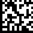
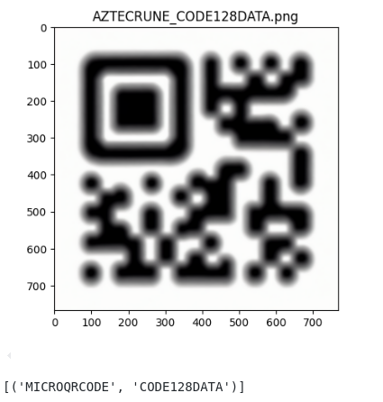
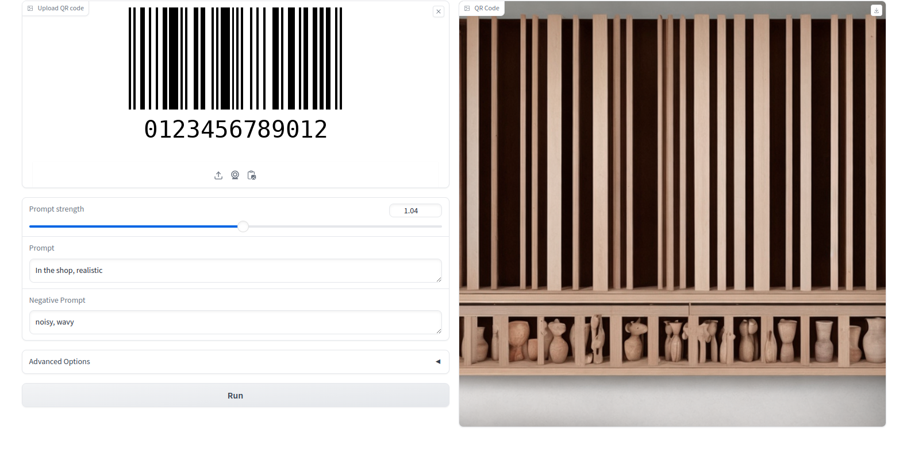
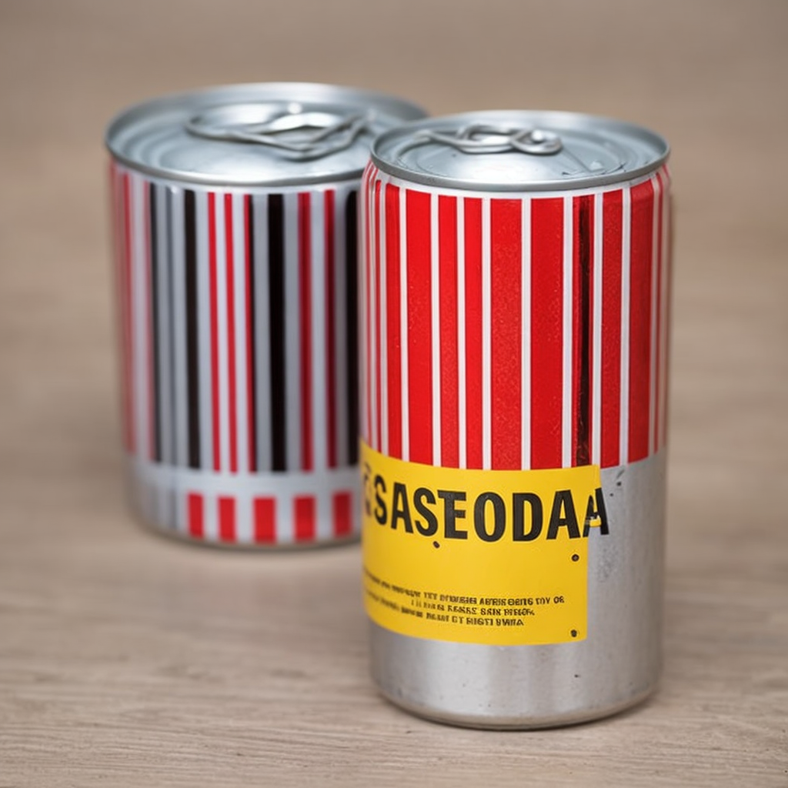

## Белков Алексей Сергеевич М01-301Б
https://github.com/alexeybelkov/mipt2024s-5-belkov-alexey/tree/rework
# Задача оптимизации генератора
Имеется генератор эталонных кодов от https://github.com/Vsevolod-pl/mipt2024s-5-plokhotnyuk-v-o

Поставлена задача оптимизации генератора

### План работы:

    -Для начала проанализирать его слабые стороны, при необходимости исправить их
    -Посмотреть распределение наших выборок и сравнить его с распределением генератора
    -Улучшить качество генерации (расширить стилизацию, добавить вставку кода на место существующего)

### Окружение
Все эксперименты проводились в Google Colab на GPU T4, список библиотек для каждого эксперимента приведен в соответсвующих секциях

# Разведка данных
Код лежит в code_classifier.ipynb

Посмотрим на распределение типов кодов в имеющиеся у нас датасетах. Аггрегацию будем делать по следующим датасетам:
- https://disk.yandex.ru/d/eOlAMqBw1xbWeg
- https://disk.yandex.ru/d/yKHmNgF8G0FKxg
- https://www.kaggle.com/datasets/arseniybelkov/barcodes-vgg
- https://www.kaggle.com/datasets/arseniybelkov/mine-barcodes

C общим количеством изображений - 143

Для определения типа кода использовал библиотеки zxing-cpp, pyzbar, python-opencv

Видим доминацию QR и EAN13 кодов в распределении

Автоматически удалось распознать 75 картинок, общее количество распознанных кодов - 90
Среди не распознанных картинок были найдены повернутые или слишком застилизованные QR коды, EAN коды перекрытые чем-то или слишком отдаленные или зашумленные

Иногда происходит совсем странные ошибки распознования:

На данный момент наш генератор генерирует коды следующих типов: 

**AZTECCODE, AZTECRUNE, CODE93, DATAMATRIX, EAN13, QRCODE**

В тоже время типы кодов в нашем датасете: 

**CODE128, CODE39, DATAMATRIX, EAN13, EAN8, PDF417, QRCODE, UPCA**

Т.е. хотим дополнить генератор до распределения: 

**AZTECCODE, EAN13, UPCA, CODE93, EAN8, AZTECRUNE, CODE128, PDF417, QRCODE, DATAMATRIX, CODE39**

**Это удалось сделать с помощью библиотек python-barcode, qrcode, segno, Aspose.BarCode for Python via .NET, treepoem**

Aspose.BarCode for Python via .NET не устанавливается на python 3.12, пришлось слезать 3.11 

Примеры сгенерированных **эталонных** кодов

| Barcode Type | Image |
|--------------|-------|
| AZTECCODE    |  |
| EAN13        |  |
| UPCA         |  |
| CODE93       |  |
| EAN8         |  |
| AZTECRUNE    |  |
| CODE128      |  |
| PDF417       |  |
| QRCODE       |  |
| DATAMATRIX   |  |
| CODE39       |  |

# Стиль и геометрия
## Классический подход
В исходный генератор укомплектованы различные аугментации: "Folding", "BadPhotoCopy", "LightingGradient" и афинное преаброзование пример генерации единичных экземляров кодов:

Одной из выявленных проблем является слишком сильные агументации поворота и афинное преобразование, т.к. результат этих искажений зависит от случайных величин генерируемых в генераторе, неплохим решением оказалось разделить все сгенерированные параметры на 2

Примеры единичной генерации, без фона

## Нейросетевой подход, диффузия
На просторах интернета нашёл апи дифузионки для стилизации QR кодов путем добавления positive и negative prompts
https://huggingface.co/spaces/huggingface-projects/QR-code-AI-art-generator

Отличительной чертой модели является возможность скармливать ей картинки кодов для стилизации

Поиграл с параметрами и промптами генерации, и моделька заработала не только для QR кодов, пример для CODE39:

Параметры генерации:

**Оригинал**

**После QR-code-AI-art-generator**

**Даже распознаётся**

#### Нашёл ещё одну модельку https://huggingface.co/spaces/kinsung/qraf

**Также распознается**

**Первой нейронкой получилось сделать серию небольших стилизаций, каждая картинка распозналась одним из декодеров**

**Примеры генерации второй нейронкой**

AztecRune

Datamatrix

AztecCode

QRCODE

Оригинал:

Стилизации через промпт In the shop, realistic

AztecCode

С одномерными кодами возникает проблема того что нейронки требуют квадратную картинку (прямоугольную они часто кропают к квадратной), решил падить коды до квадратного размера следующим образом: если $(H, W)$ -исходный шейп картинки, то $(max(H, W), max(H, W))$ - шейп после паддинга, паддим белыми пикселями. **Паддинг заметно улучшил генерацию**

**Примеры 1D кодов ДО паддинга**

**Примеры 1D кодов ПОСЛЕ паддинга**

Генерация проводлиась в браузере через публичное АПИ (для инфересена сеток требуется GPU). На данный момент встроил диффузионки в пайплайн генератора (код генератора в generator.py), для 31 картинки генерация заняла 26 минут

Примеры:

Обе нейросети основываются на статье про ControlNet https://arxiv.org/pdf/2302.05543 

Zero convolutions - свёртки 1x1 с нулевой инициализацией параметров

### Объеденим нейросетевой подход и классический
Окружение: Google Colab env, python <=3.11

pip install diffusers transformers accelerate torch xformers python-barcode qrcode segno treepoem aztec-code-generator augraphy gradio

Код пайплайна генерации лежит в generator_pipeline.ipynb

#### Для начала сегенерируем несколько эталонных кодов

До

После

До

После

Поменял промпт: On a mobile phone

До

После

#### Теперь применим имещиеся аугментации

# Репозиторий
Репозиторий https://github.com/alexeybelkov/mipt2024s-5-belkov-alexey/tree/rework
Список библиотек
pip install diffusers transformers accelerate torch xformers python-barcode qrcode segno treepoem aztec-code-generator augraphy gradio

